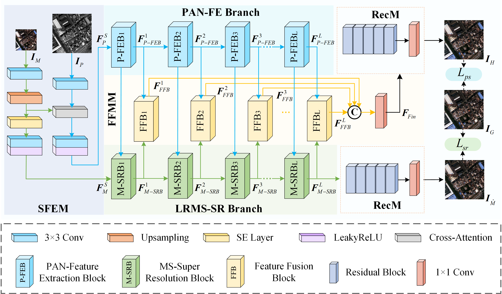

# DCPNet: A Dual-task Collaborative Promotion Network for Pansharpening

The official repository for [DCPNet: A Dual-task Collaborative Promotion Network for Pansharpening].

## Pipeline



### Requirements

Pytorch >= 1.10.1

Python >= 3.7

We use RTX3090 GPU to complete training. Please ensure that your video memory is above 12G.

### Prepare Datasets

Download the PanCollection dataset [HERE](https://liangjiandeng.github.io/PanCollection.html).

Then put them under the directory like: 

```Data
...\UDL\Data
├── pansharpening
│   ├── training_data
│   │   ├── ...
│   ├── validation_data
│   │   │   ├── ...
│   ├── test_data
│   │   ├── 'satellite name'
│   │   │   ├── ...
```

### To Train

It should be noted that the code in the folder named 'UPNet' is actually the code for 'DCPNet'. 'UPNet' was the name used during the early experimental stages. For the convenience of readers to directly test and verify our performance, no changes have been made.

Model  path: 

```model
...\UDL\pansharpening\models\UPNet
```

Parameter settings：

```
...\UDL\pansharpening\configs
```

Train:

```Train
cd UDL\pansharpening
pythion run_pansharpening.py
```

### To Test 

Put the corresponding trained model in 'UDL\pansharpening\trained-model' to the following path：

```test
...\UDL\results\pansharpening\'satellite name'\UPNet\Test
```

```test
cd UDL\pansharpening
pythion run_test_pansharpening.py
```

### Contact

If you have any questions, please feel free to contact me.(yxj971220@163.com).

### Citation


### Acknowledgement

We would like to express our gratitude to Deng et al. for the publicly available dataset [PanCollection](https://liangjiandeng.github.io/PanCollection.html) and the unified code framework [DLPan Toolbox](https://github.com/liangjiandeng/DLPan-Toolbox).

For more details on the dataset and code framework, please refer to the following paper:

```bibtex
@ARTICLE{deng2022grsm,
author={L.-J. Deng, G. Vivone, M. E. Paoletti, G. Scarpa, J. He, Y. Zhang, J. Chanussot, and A. Plaza},
booktitle={IEEE Geoscience and Remote Sensing Magazine},
title={Machine Learning in Pansharpening: A Benchmark, from Shallow to Deep Networks},
year={2022},
pages={},
}
```


